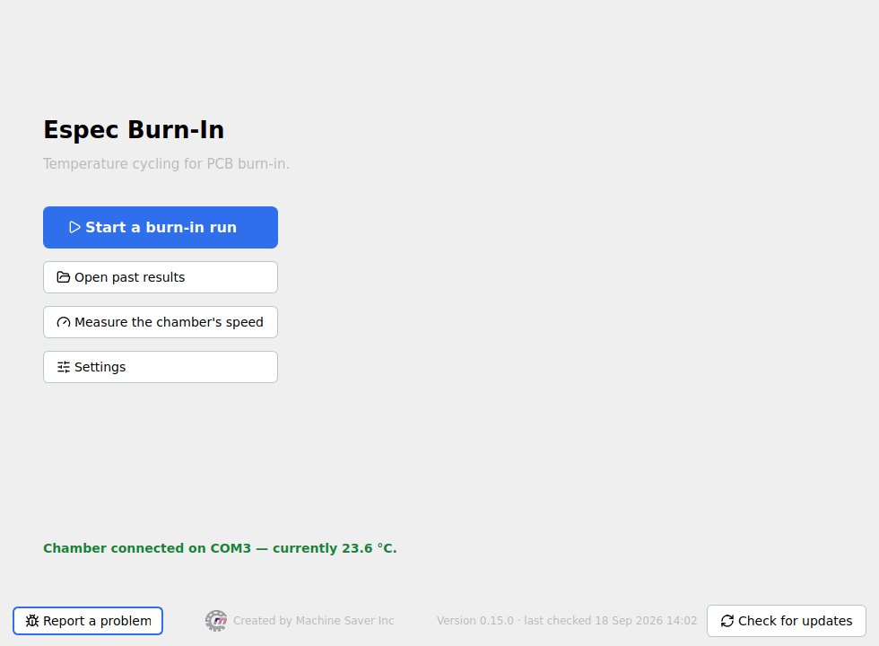
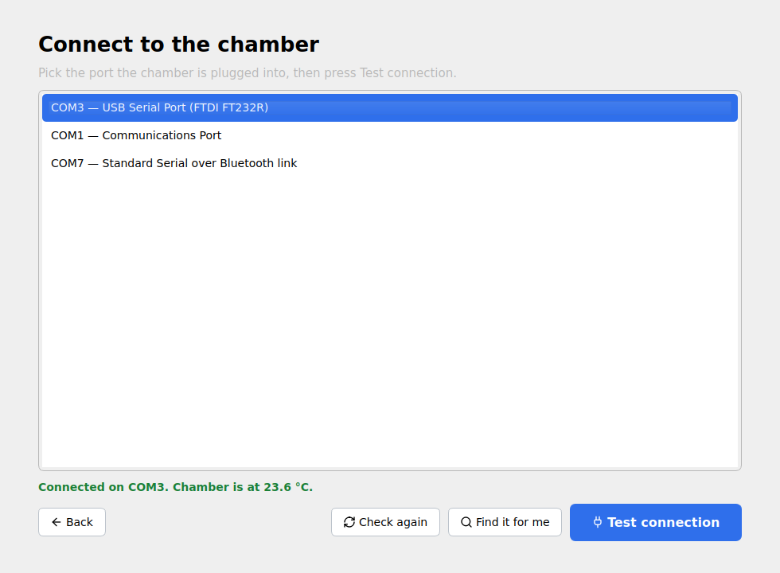
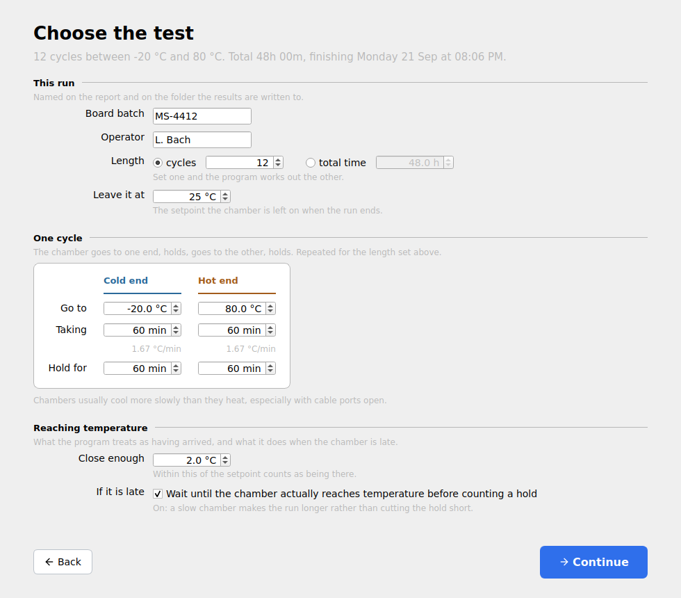
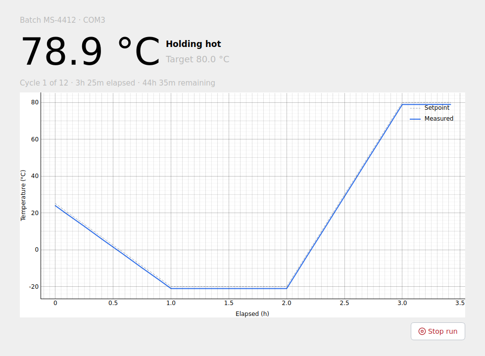
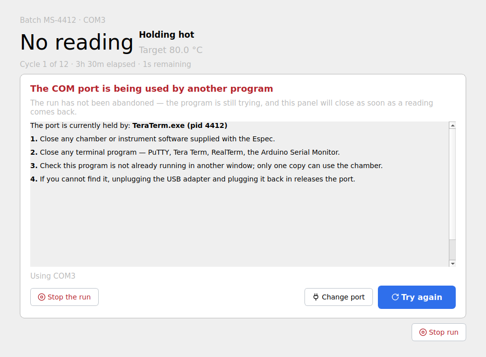
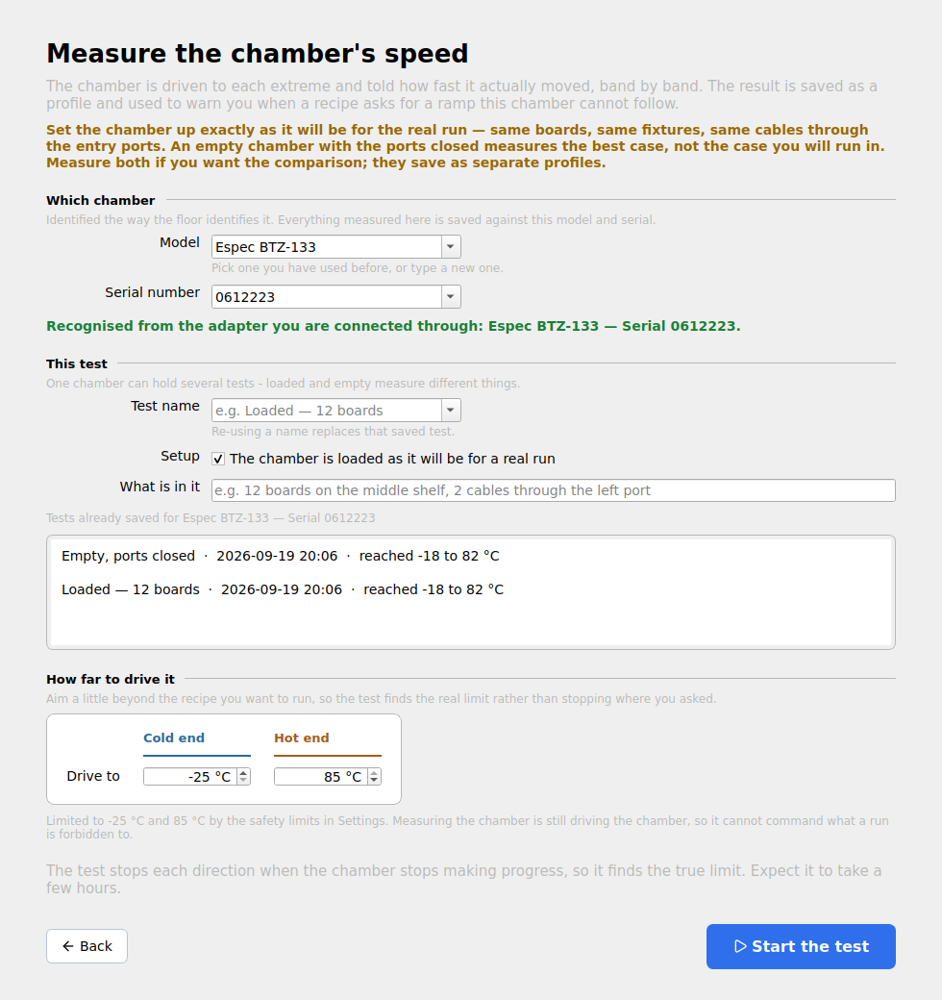
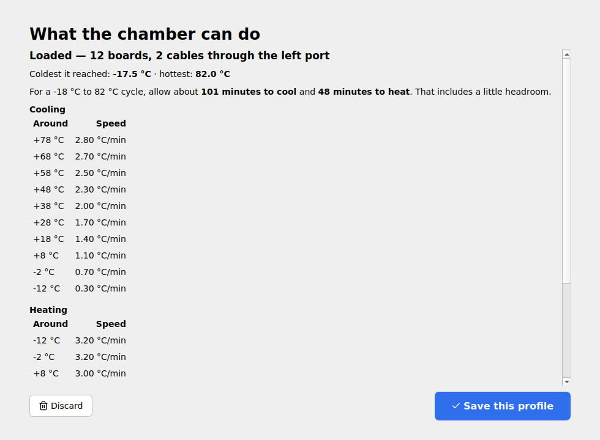
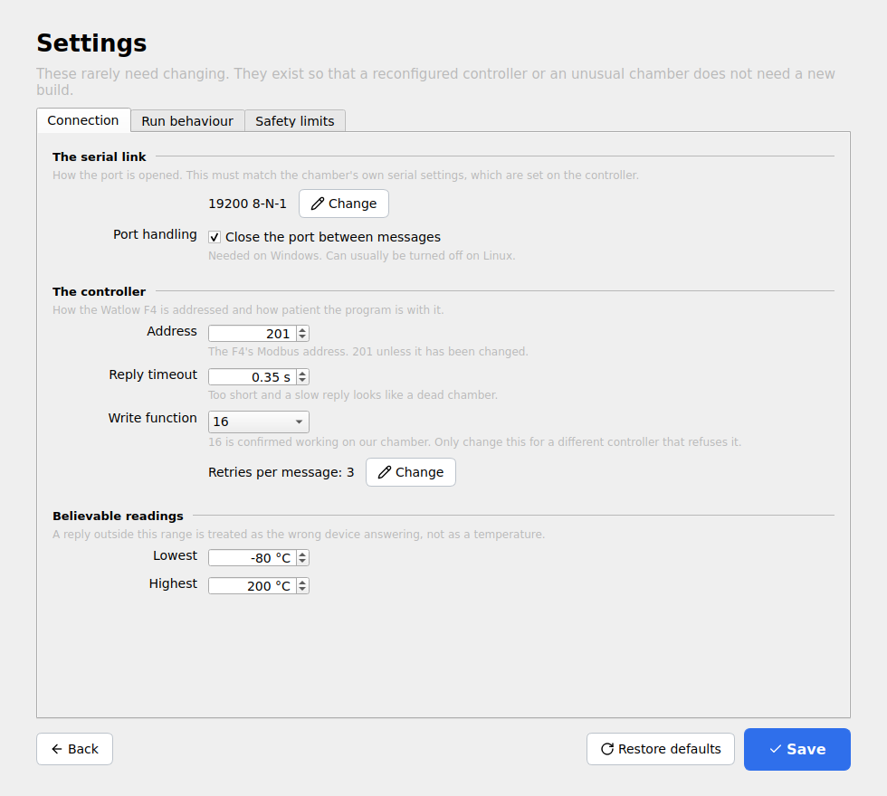
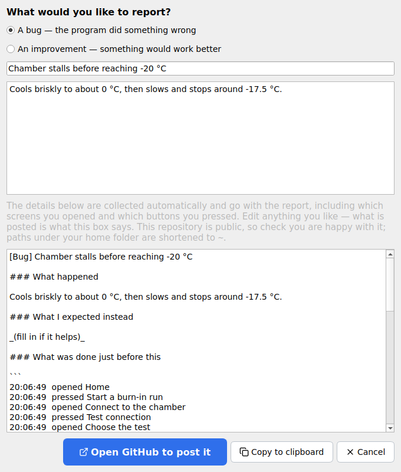

# Espec Burn-In

Temperature cycling for PCB burn-in. Drives an Espec chamber through a thermal
cycle between −20 °C and +80 °C via its **Watlow F4** controller over Modbus
RTU, to force board flexing and surface defects *before* the boards are soldered
and potted.

> **This program is not a safety system.** The chamber's independent
> over-temperature limit controller is the protective device. It must be set
> correctly and working before any unattended run.

---

## Download

### **[⬇ Get the latest release](https://github.com/Machine-Saver-Inc/espec-temperature-cycling/releases/latest)**

| Your computer | File |
| --- | --- |
| **Windows 10 / 11** | `EspecBurnIn-Setup-<version>.exe` |
| **Debian / Ubuntu** | `espec-burn-in_<version>_amd64.deb` |
| **Other Linux** | `EspecBurnIn-<version>-x86_64.AppImage` |

Python, Qt and every dependency are bundled, so the downloads are large
(40–90 MB depending on platform) but there is nothing to install afterwards.
Each release page lists the exact size beside every file.

### Installing on Windows

1. Download `EspecBurnIn-Setup-<version>.exe` from the **Assets** list on the
   release page.
2. Double-click it.
3. Windows will say **"Windows protected your PC"**. That is expected — the
   installer is not code-signed yet. Click **More info**, then **Run anyway**.
4. Click through the installer. It needs **no administrator rights** and
   installs for your user only. Leave *Create a desktop shortcut* ticked.
5. Launch **Espec Burn-In** from the desktop icon.

### Installing on Linux

```sh
# Debian / Ubuntu
sudo apt install ./espec-burn-in_<version>_amd64.deb

# Anything else
chmod +x EspecBurnIn-*.AppImage && ./EspecBurnIn-*.AppImage
```

If the program cannot open the serial port:

```sh
sudo usermod -aG dialout $USER   # then log out and back in
```

### Checking what you downloaded

Every release includes `SHA256SUMS`:

```sh
sha256sum -c SHA256SUMS --ignore-missing
```

---

## How to use it

### 1. Open the program



The green line confirms the chamber is connected and shows its current
temperature. The installed version and the last update check are along the
bottom. If no chamber is connected yet, **Start a burn-in run** takes you to the
connection screen first.

### 2. Connect to the chamber



Pick the port the chamber is plugged into and press **Test connection**. USB
serial adapters are sorted to the top and Bluetooth ports to the bottom, because
picking a Bluetooth port is the usual mistake.

**`Connected on COM3. Chamber is at 23.6 °C.` in green is what confirms you
picked right** — not the port name. If you are not sure, **Find it for me**
tries each port until one answers.

The adapter is remembered by its own serial number, not by `COM3`, so it is
found again even if it is plugged into a different socket next time.

### 3. Choose the test



Type the board batch name — it names the results folder. Everything else has a
working default: 12 cycles of 4 hours, −20 °C to +80 °C, which comes to 48 hours.

The screen is in sections, and each says what it is for.

- **This run** is the paperwork: who is running it, what is in the chamber, how
  long for, and where the chamber is left afterwards. **Length** can be a number
  of **cycles** or a **total time** — set one and the program works out the
  other.
- **One cycle** is the shape the chamber repeats: go to the cold end, hold, go
  to the hot end, hold. The two ends sit side by side so they can be compared.
  Under each ramp time is the rate it works out to, which is what the chamber
  actually has to achieve. Cooling and heating are set separately because
  chambers rarely cool as fast as they heat — more so with cables through the
  entry ports.
- **Reaching temperature** is what counts as having arrived, and what happens
  when the chamber is late. With **guaranteed soak** on, a hold does not start
  counting until the chamber is actually at temperature, so a slow chamber makes
  the run longer rather than cutting the hold short.

The line under the title recalculates as you change things, and tells you when
the run will finish. There is nothing to tell it about the chamber's current
temperature: it reads that itself when the run starts, and begins the first
cooling ramp from wherever the chamber actually is.

### 4. Watch it run



Current temperature in large type, the target beside it, which cycle you are on,
and time elapsed and remaining. The plot shows measured temperature against the
commanded setpoint.

Leave the computer on — the program keeps it awake for the duration. If it is
interrupted anyway, reopening offers to resume from where it got to.

### 5. If something goes wrong



The run is not abandoned when the chamber stops answering. The program keeps
retrying and tells you what to check, with steps specific to what actually
happened — a port held by another program, an unplugged adapter, a permissions
problem, or a chamber that is switched off. On Linux it names the program
holding the port.

The panel closes itself the moment a reading comes back.

### 6. Read the results

Everything for one run lands in `Documents/Espec Burn-In/<batch> <date>/`:

| File | What it is |
| --- | --- |
| `report.html` | self-contained report — chart, cycles completed, verdict, and how the chamber paced itself |
| `run.csv` | every sample: timestamp, cycle, phase, setpoint, measured, comms status |
| `run.json` | the recipe and live position — what makes a crashed run resumable |

The report also breaks the run into five-degree bands and says how many minutes
and how many degrees per minute the chamber managed in each, cooling and
heating, marking the point where it ran out of capacity. Averaged over a whole
ramp, a chamber that is slow throughout and one that is fine until the last few
degrees look the same; the bands tell them apart, which is the difference
between a chamber that needs servicing and a recipe that needs a longer ramp.

`tools/analyse_measurement.py` prints the same breakdown from a `run.csv` at the
command line, including for a run that was stopped part-way:

```bash
python tools/analyse_measurement.py "…/Espec Burn-In/<batch> <date>/run.csv"
```

---

## Measuring what the chamber can actually do

Whether the chamber can follow a commanded ramp depends on the load and on how
much heat leaks through the cable entry ports. **Measure the chamber's speed**
drives it to each extreme and records how fast it actually moved, in 5 °C bands.



A measurement belongs to a **chamber**, identified by its model and serial
number the way it is identified on the floor. Tests hang underneath: one
chamber can hold *Loaded — 12 boards* and *Empty, ports closed* side by side,
and the tests already saved for that chamber are listed as you set a new one up.

Both fields remember what you have used before, and if you connect through the
same USB adapter as last time the chamber is recognised without typing anything.
Runs record the chamber too, so a report says which one it came from.



- **Speed is not constant.** A chamber that pulls down at 2.8 °C/min near +75
  may manage 0.3 °C/min over the last few degrees to −20, so most of the time is
  spent at the ends. Rates are recorded per band and integrated, never averaged.
- **An empty chamber is the best case, not your case.** Set it up the way the
  real run will be — same boards, same cables through the ports — and say so
  when you save the profile.

Every sample is written to disk as it happens, into
`Documents/Espec Burn-In/Chamber tests/<chamber> - <test> <date>/`:

| File | What it is |
| --- | --- |
| `measurement.csv` | every sample: timestamp, direction, target, measured, rate, band, and whether it counted as progress |
| `profile.json` | the banded summary and the limits reached |

A measurement runs for hours and a stalling chamber is exactly what it is
looking for, so **stopping it early keeps everything taken up to that point.**
`tools/analyse_measurement.py` turns either file into a band-by-band breakdown
of where the chamber slowed and where it stopped making progress.

It also records the coldest and hottest actually reached, and **why the leg
ended** — whether it got there, stalled, or simply ran out of test time. Those
are different facts. A chamber reaches colder than a two-hour test had time to
show; it just takes longer, because every further degree is more work than the
one before it. Only a stall is treated as a limit.

Once a profile exists, the recipe screen warns when a ramp is too fast for the
chamber and offers **Use the measured times**. Asked about a temperature further
out than the test went, it continues the slowdown the test did measure rather
than assuming the last rate holds — and says the figure is an estimate, and a
best case.

---

## Settings



Everything the program relies on is editable, so a reconfigured controller does
not need a new build:

- **Connection** — controller address, baud rate, data bits, parity, stop bits,
  reply timeout, retries, setpoint write function code, and what counts as a
  believable reading.
- **Run behaviour** — sample interval, how small a setpoint change is worth
  sending, how long the chamber may stay unreachable, and how far guaranteed
  soak may stretch a run before it is failed.
- **Safety limits** — the hard clamp on commanded setpoints and the runaway
  detection thresholds. Widening the clamp asks for confirmation.

---

## Updates

The program checks for a new release each time it opens, and once a day while
idle. If there is one, a banner appears naming the version, with **What's new**,
**Update now** and **Later**.

**Update now** does the whole thing: downloads the file for your platform,
checks it against the `SHA256SUMS` published with the release, and installs it.
On Windows the installer runs silently and the program reopens on the new
version. A Linux AppImage replaces itself and restarts. A `.deb` cannot be
installed without root, so the program shows you the one `apt` command.

A download that does not match its published checksum is **not** installed. If
the checksum list cannot be fetched at all, the update is refused rather than
trusted.

Updates are never offered during a run.

If the chamber PC has no internet it will never hear about a release. The home
screen shows the installed version and when it last managed to check, and
`espec-burn-in --version` prints it from a command line.

---

## Reporting a problem



Every screen carries the same footer: **Report a problem** on the left, who made
the program in the middle, and the version you are running with **Check for
updates** on the right.

**Report a problem** sits in the bottom-left corner of every screen. It fills in
a GitHub issue for you with what is usually asked for anyway: the version, which
screen was open, how the chamber is connected, the controller settings and
safety limits, whether a run was going and what it was doing, and the last lines
of the log.

It also lists **what you did just before** — the screens you opened and the
buttons you pressed, in order. That is usually the answer to "how do I reproduce
this", and nobody should have to remember it. Only labels are recorded, never
anything you typed.

Choose **a bug** or **an improvement** — the two produce different templates and
land under different labels. The report is editable: what gets posted is exactly
what the preview says, so you can add a detail or take one out. You see it all
before anything is sent,
and it is copied to your clipboard as well, so nothing is lost if the browser
does not open.

Paths under your home folder are shortened to `~` before the report is shown,
because the repository is public.

## When it will not connect

See [docs/TROUBLESHOOTING.md](docs/TROUBLESHOOTING.md). The same steps appear in
the program itself.

---

## Development

```sh
pip install -e ".[dev]"
pytest                      # includes a full simulated 48-hour run
python -m espec_burnin
python tools/screenshots.py # regenerate the images above
```

`espec_burnin/hardware/simulator.py` is a real Modbus RTU slave on a
pseudo-terminal — correct CRC, framing and signed encoding, with a thermal model
— so the whole application can be exercised with no chamber. A 48-hour run takes
seconds under a virtual clock. That is deliberate: a 48-hour run cannot be the
development loop.

Protocol details, and the two bugs inherited from the original notebook, are in
[docs/F4-PROTOCOL.md](docs/F4-PROTOCOL.md).

## Releases

Tag and push; CI does the rest.

```sh
git tag v0.6.0 && git push origin v0.6.0
```

The workflow builds on Windows and Linux, writes `SHA256SUMS`, and publishes the
release with the install instructions from `packaging/release-notes.md`.
Regenerate the screenshots and update this README in the same commit as the
version bump.
